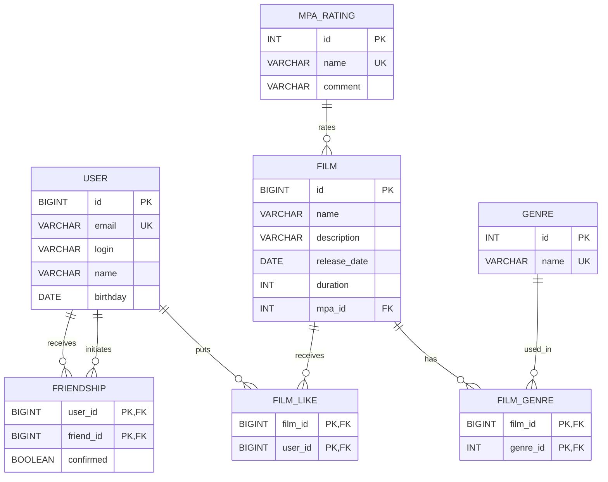

# java-filmorate
Template repository for Filmorate project.




Или
https://app.quickdatabasediagrams.com/#/

```
User as u
------
id PK bigint
email varchar(255) UNIQUE
login varchar(255)
name varchar(255)
birthday date

Film as f
------
id PK bigint
name varchar(255)
description varchar(200)
release_date date
duration int
mpa_id int FK >- mpa.id

Genre as g
------
id PK int
name varchar(100) UNIQUE

MpaRating as mpa
------
id PK int
name varchar(10) UNIQUE
comment varchar(255)


FilmGenre as fg
------
film_id PK bigint FK >- f.id
genre_id PK int FK >- g.id

FilmLike as fl
------
film_id PK bigint FK >- f.id
user_id PK bigint FK >- u.id

Friendship as fr
------
user_id PK bigint FK >- u.id
friend_id PK bigint FK >- u.id
confirmed bool
```


