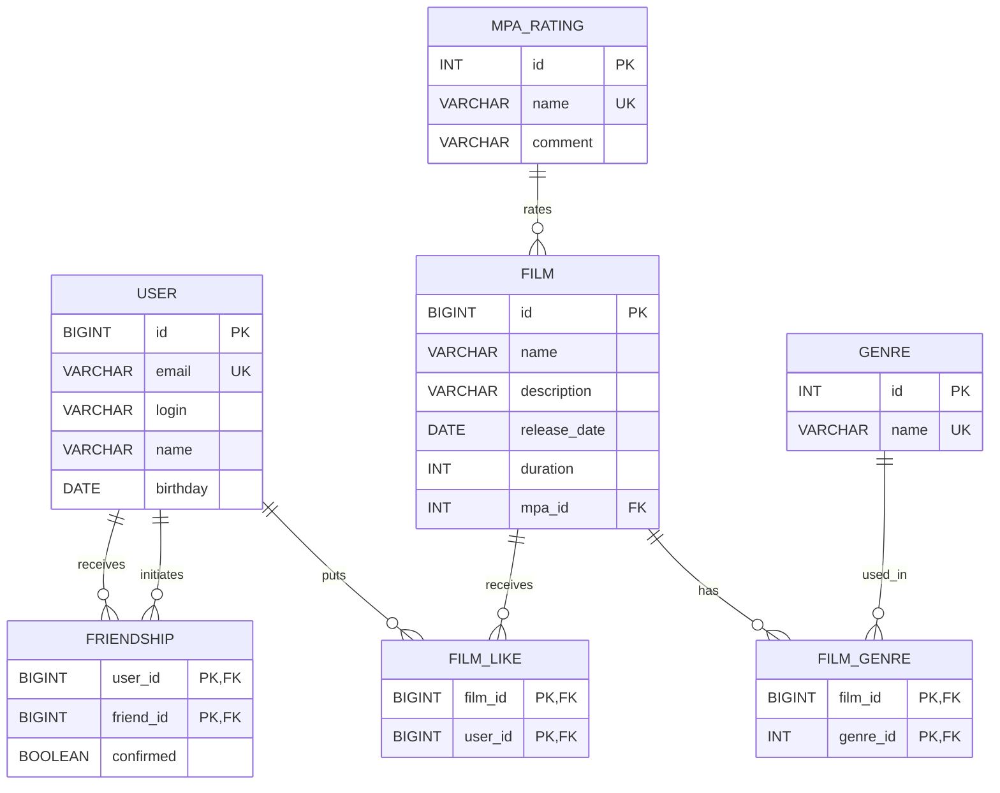
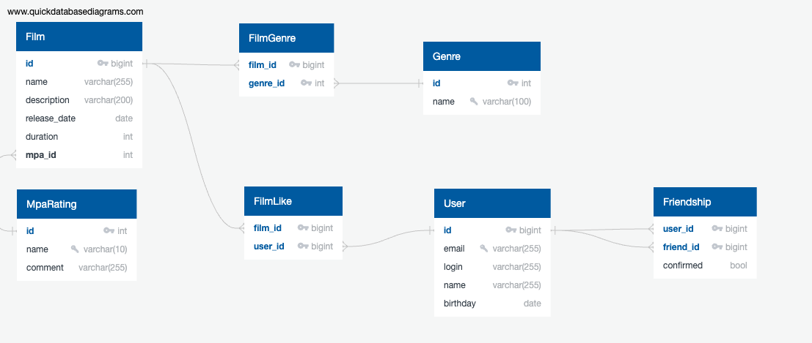

# java-filmorate
Template repository for Filmorate project.




Или
https://app.quickdatabasediagrams.com/#/

```
User as u
------
id PK bigint
email varchar(255) UNIQUE
login varchar(255)
name varchar(255)
birthday date

Film as f
------
id PK bigint
name varchar(255)
description varchar(200)
release_date date
duration int
mpa_id int FK >- mpa.id

Genre as g
------
id PK int
name varchar(100) UNIQUE

Mpa_Rating as mpa
------
id PK int
name varchar(10) UNIQUE
comment varchar(255)


Film_Genre as fg
------
film_id PK bigint FK >- f.id
genre_id PK int FK >- g.id

Film_Like as fl
------
film_id PK bigint FK >- f.id
user_id PK bigint FK >- u.id

Friendship as fr
------
user_id PK bigint FK >- u.id
friend_id PK bigint FK >- u.id
confirmed bool
```

Примеры запросов 

### Получение всех фильмов с рейтингом
```sql
SELECT f.*, m.name AS mpa_name
FROM films f
JOIN mpa_ratings m ON f.mpa_id = m.id;
```

### Получение фильма с номером 1 с жанрами
```sql
SELECT f.*, g.name AS genre
FROM films f
LEFT JOIN film_genre fg ON f.id = fg.film_id
LEFT JOIN genres g ON fg.genre_id = g.id
WHERE f.id = 1;
```


### Добавление фильма
```sql
INSERT INTO films (name, description, release_date, duration, mpa_id)
VALUES ('Матрица', 'Фильм про матрицу', '1999-03-31', 136, 4);
```

### Добавление жанра фильму
```sql
INSERT INTO film_genre (film_id, genre_id)
VALUES (1, 2);
```

### Поставить лайк фильму
```sql
INSERT INTO film_like (film_id, user_id)
VALUES (1, 10);
```

### Удалить лайк
```sql
DELETE FROM film_like
WHERE film_id = 1 AND user_id = 10;
```

### Отправка запроса в друзья
```sql
INSERT INTO friendship (user_id, friend_id, confirmed)
VALUES (1, 2, false);
```

### Подтверждение дружбы
```sql
UPDATE friendship
SET confirmed = true
WHERE user_id = 1 AND friend_id = 2;
```

### Получение списка друзей
```sql
SELECT u.*
FROM users u
JOIN friendship f ON u.id = f.friend_id
WHERE f.user_id = 1 AND f.confirmed = true;
```

### Получение общих друзей
```sql
SELECT u.*
FROM users u
JOIN friendship f1 ON u.id = f1.friend_id
JOIN friendship f2 ON u.id = f2.friend_id
WHERE f1.user_id = 1
  AND f2.user_id = 2
  AND f1.confirmed = true
  AND f2.confirmed = true;
```

---

